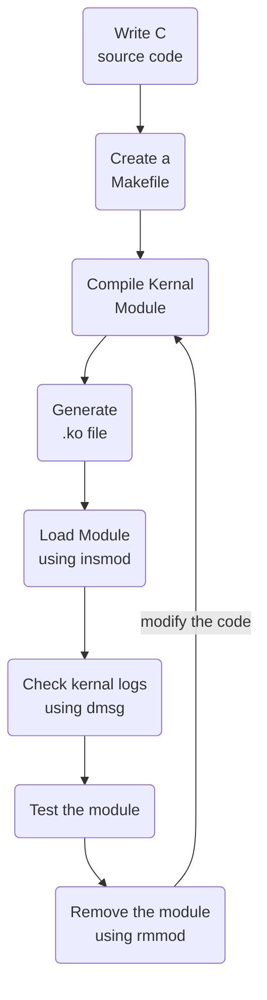

# Introduction to Linux Kernel Module Development

Linux provides a powerful mechanism called **Kernel Modules** that allows functionality to be added to or removed from the running kernel without rebuilding or rebooting the entire operating system.

In this tutorial series, we will explore the fundamentals of **Linux Kernel Module Development using the C programming language**. The focus will be on understanding how kernel modules work, how to compile and load them, and how to debug them using the Linux command line.

----------

## Prerequisites

Before starting with kernel module development, you should have a basic understanding of:

-   C programming
-   Functions, pointers, structures, and macros in C
-   Compiling C programs using GCC
-   Basic Linux command-line operations
-   Basic understanding of Linux processes and system architecture
    
For this tutorial, we will primarily use the **Linux CLI** rather than graphical development environments. Working directly from the command line makes it easier to understand the compilation process and inspect kernel messages during development.

----------

# Kernel vs. Kernel Module

Before writing our first module, it is important to understand the difference between the **Linux kernel** and a **kernel module**.

### What is the Linux Kernel?

The Linux kernel is the core component of the operating system. It manages system resources and provides an interface between applications and hardware.
Some of its major responsibilities include:
-   Process management
-   Memory management
-   File systems
-   Networking
-   Device management
-   Hardware interaction
-   Providing system calls to user-space applications
    
The kernel is loaded during the system boot process and remains active while the operating system is running.

> Note: The kernel itself is not simply "the first process." During boot, the kernel initializes the system and eventually starts the first user-space process, traditionally `init` or a system manager such as `systemd`.

----------

## What is a Kernel Module?

A **kernel module** is a piece of code that can be dynamically loaded into and removed from the Linux kernel while the system is running.
Kernel modules are commonly used for:
-   Device drivers
-   Filesystem support
-   Networking functionality
-   Hardware interfaces
-   Security functionality
-   Other kernel-level features

A module runs in **kernel space**, which gives it significantly more privileges than a normal user-space application.

However, this also means that a programming mistake inside a kernel module can potentially crash or destabilize the entire system.
A useful way to think about a module is as an extension to the running kernel—not as a simple Java-style function override.

----------

# Where Are Kernel Module Development Files Located?

When kernel development packages and headers are installed, Linux commonly provides a build directory such as:
```text
/lib/modules/<kernel-version>/build/
```
For example:
```text
/lib/modules/6.8.0-xx-generic/build/
```
You can check your current kernel version using:
```bash
uname -r
```

Then inspect the corresponding build directory:
```bash
ls /lib/modules/$(uname -r)/build/
```

This directory contains the kernel build infrastructure and relevant headers required to compile external kernel modules.
It is important to understand that these headers are **not automatically included in every module source file**. Kernel modules use the kernel's build system, typically through a `Makefile`, to provide the correct compiler options, include paths, configuration, and build environment.

----------

# Why Develop Kernel Modules?

Kernel modules allow developers to interact with functionality that operates at the kernel level.
For example, kernel modules can be used to develop or interact with:
### Hardware
Linux device drivers and kernel subsystems can interact with hardware such as:
-   USB devices
-   GPIO
-   SPI
-   I²C
-   PCI devices
-   Storage devices
-   Network interfaces

### Networking

Kernel-level networking functionality can be implemented or extended through mechanisms provided by the Linux networking stack.

### Filesystems

Kernel modules can also implement or extend filesystem functionality.

### Learning and Research

Kernel modules are particularly useful for learning how the Linux kernel works internally.
They provide a practical way to experiment with:
-   Kernel APIs
-   Processes
-   Memory
-   Devices
-   Networking
-   Kernel logging
-   Synchronization
-   System interfaces

----------

# Basic Kernel Module Commands

Linux provides several commands for managing kernel modules.

## 1. `lsmod`

`lsmod` displays the kernel modules currently loaded into the system.
```bash
lsmod
```
Example:
```text
Module                  Size  Used by
...

```

The output includes information about loaded modules and their dependencies.

----------

## 2. `insmod`
`insmod` is used to insert a kernel module into the running kernel.
For example:
```bash
sudo insmod hello.ko
```

Here, `hello.ko` is the compiled kernel module.
The `.ko` extension stands for **Kernel Object**.

----------

## 3. `rmmod`
`rmmod` removes a loaded kernel module from the running kernel.
```bash
sudo rmmod hello
```
The module must generally not be in use by another kernel component when it is removed.

----------

## 4. `dmesg`
Kernel modules commonly use the kernel logging system to report information, warnings, and errors.
You can view kernel messages using:
```bash
dmesg
```

For easier debugging, you can filter the output:
```bash
dmesg | tail
```

Depending on your distribution and system configuration, you may need root privileges:
```bash
sudo dmesg
```

----------

# Kernel Module Development Workflow
The basic workflow for developing a kernel module looks like this:

----------

# Practical: Inspecting Kernel Modules

Let's start with some basic observations before writing our first module.

### Step 1: Check the running kernel version

```bash
uname -r
```

This tells us which kernel is currently running.

----------

### Step 2: List loaded kernel modules

```bash
lsmod

```

This displays the modules currently loaded into the kernel.

----------

### Step 3: Inspect kernel messages

Run:

```bash
dmesg | tail
```

This displays the latest kernel messages.

You can also monitor kernel messages while working with modules using:

```bash
sudo dmesg -w
```

Now keep this terminal open while loading and removing modules. You will be able to see new kernel messages as they occur.

----------

# What's Next?

In the next part, we will create our **first Linux kernel module using C**.

We will learn:
1.  Basic kernel module structure
2.  `module_init()`
3.  `module_exit()`
4.  `printk()` / kernel logging
5.  Writing a `Makefile`
6.  Compiling a `.ko` file
7.  Loading the module with `insmod`
8.  Checking the output with `dmesg`
9.  Removing the module with `rmmod`    
10.  Understanding common compilation and loading errors
    
By the end of the first practical exercise, we will have a working kernel module running inside the Linux kernel.
