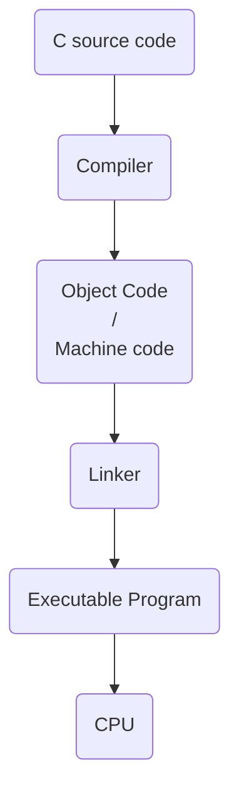
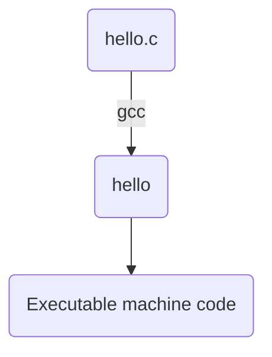
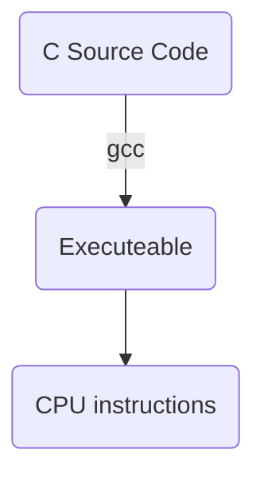
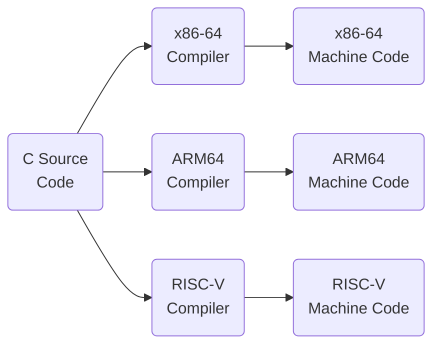
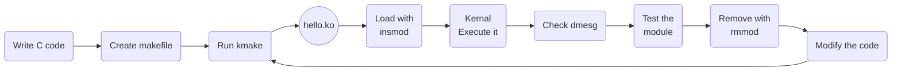
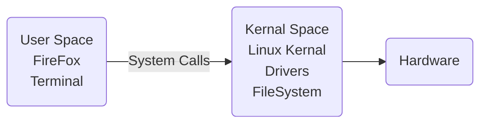

# Understanding C, Compilation, GCC, Make, and the Kernel Build Environment

Before jumping directly into Linux kernel module development, there is one important thing we need to understand:
> **A kernel module is written in C, so understanding how C programs are compiled and built is essential before working at the kernel level.**

This is the starting point of this series.
In the previous introduction, we looked at what the Linux kernel is, what kernel modules are, and how modules can be loaded into and removed from a running kernel.
Now we are going one step backward.
Before writing our first `.ko` file, we need to understand **how a C program becomes executable code**, what a compiler does, what `gcc` and `make` are used for, and how the Linux kernel provides the environment required to build an external kernel module.

----------
### 1. Why Do We Need C?
The Linux kernel is primarily written in the **C programming language**, with some parts written in assembly and other languages used for specific purposes.
Therefore, when developing a traditional Linux kernel module, we will also work primarily with C.
But kernel programming is not exactly the same as normal C programming.
In a normal C application, we can use libraries such as:
```c
#include <stdio.h>
#include <stdlib.h>
#include <string.h>
```
and call functions such as:
```c
printf();
malloc();
free();
```
These functions are provided through the user-space environment and libraries available to normal applications.
A kernel module works in a completely different environment.
For example, instead of using:
```c
printf();
```
kernel code commonly uses:
```c
printk();
```
or the newer kernel logging macros such as:
```c
pr_info();
pr_err();
pr_warn();
```
This distinction is important:
> **Kernel code cannot simply use every function available to a normal C application.**
The kernel provides its own APIs and facilities.

_____
### 2. What Kind of Language Is C?

C is commonly described as a **procedural or imperative programming language**.
A C program is generally organized around:
-   Functions
-   Variables
-   Data structures
-   Pointers
-   Control flow
-   Memory manipulation
For example:
```c
#include <stdio.h>
int main()
{
    printf("Hello World\n");
    return 0;
}
```
The program contains instructions that are executed according to the program's control flow.
C gives the programmer relatively low-level control over memory and system resources compared with many higher-level languages.
This is one of the reasons C has historically been extremely important for operating systems and systems programming.

----------

### 3. Is C Platform Independent?

This is where things become slightly more complicated.
You may hear that:
> "C is not platform independent."
That statement is too simplistic.

C itself is a standardized programming language, but **compiled C programs are generally platform-dependent**.
For example, suppose we have:
```c
int main()
{
    return 0;
}
```
We can compile this source code for different architectures.
The resulting machine code for an:
-   x86-64 processor
-   ARM64 processor
-   RISC-V processor

will not necessarily be the same.

The source code may be portable, but the generated executable depends on the target architecture, operating system, ABI, compiler, libraries, and other factors.
This is why compilation is important.

----------

### 4. Source Code vs Machine Code
When we write:
```c
#include <stdio.h>
int main()
{
    printf("Hello World\n");
    return 0;
}
```
the processor cannot directly execute the C source code.
The CPU ultimately executes **machine instructions**.
A simplified view of the process is:



The compiler translates C code into instructions suitable for the target architecture.
For example:


This is the basic idea behind compilation.

----------

### 5. What Is GCC?
One of the most commonly used C compilers on Linux is **GCC**.
GCC originally stood for:
> **GNU C Compiler**

Today, GCC is part of the larger GNU Compiler Collection and supports multiple programming languages.
For C development, we commonly use:
```bash
gcc
```
We can check whether GCC is installed using:
```bash
gcc --version
```
The exact version will depend on your Linux distribution.

----------

### 6. Installing GCC

On Debian-based distributions such as Ubuntu, Debian, and Kali Linux, you can install GCC using:
```bash
sudo apt update
sudo apt install gcc
```
However, for general C development, it is usually better to install the standard build tools as well.
On Debian/Ubuntu/Kali:
```bash
sudo apt update
sudo apt install build-essential
```
The `build-essential` package is useful because it provides commonly required development tools, including:
-   GCC
-   GNU Make
-   Standard C development components
-   Other tools required for building software

After installation, verify GCC:
```bash
gcc --version
```
And verify Make:
```bash
make --version
```
----------

## 7. Our First C Program
Before touching the kernel, let's compile a normal C program.
Create a file:
```bash
vim hello.c
```
Add:
```c
#include <stdio.h>
int main()
{
    printf("Hello from C!\n");
    return 0;
}
```

Save the file.
Now compile it:
```bash
gcc hello.c -o hello
```
This command tells GCC:
```text
gcc       -> use the GCC compiler
hello.c   -> input source file
-o hello  -> create an output file named hello
```

Run the program:

```bash
./hello
```

Output:
```text
Hello from C!
```

Congratulations.
We have just gone through the basic process of:

----------

### 8. What Is Make?

As projects become larger, manually typing compiler commands becomes inconvenient.
Imagine a project containing:
```text
main.c
network.c
memory.c
device.c
filesystem.c
```

We would have to manage compilation of all these files and their dependencies.
This is where **Make** becomes useful.
`make` is a build automation tool.
Instead of repeatedly typing complicated compilation commands, we can define the build instructions inside a file called:
```text
Makefile
```
For example:
```makefile
all:
	gcc hello.c -o hello
```
Now we can simply run:
```bash
make
```
and Make executes the command.
This becomes extremely useful when working with the Linux kernel because the kernel has a large and sophisticated build system.

----------

### 9. Why Is Make Important for Kernel Modules?
A kernel module is not compiled like an ordinary C application.
We cannot simply do:
```bash
gcc hello.c -o hello
```
and expect a valid kernel module.
The kernel has specific requirements regarding:
-   Compiler options
-   Kernel configuration
-   Header files
-   Architecture
-   Symbol information
-   Module metadata
-   Kernel APIs
-   ABI compatibility
-   Module signing
-   Build configuration

Therefore, external kernel modules are normally built using the **Linux kernel's build system**, commonly called **Kbuild**.
This is where the directory:
```text
/lib/modules/<kernel-version>/build/
```

becomes important.

----------

### 10. Understanding `/lib/modules/<kernel-version>/build/`

First, find the kernel you are currently running:
```bash
uname -r
```
For example:
```text
6.x.x-generic
```
Linux commonly has a corresponding directory:
```text
/lib/modules/6.x.x-generic/
```
Inside it, you may find:
```text
build
```
So:
```text
/lib/modules/<kernel-version>/build/
```
typically points to the kernel build environment associated with the running kernel.
You can inspect it using:
```bash
ls -l /lib/modules/$(uname -r)/build
```
This directory is important because the kernel build system uses it to compile external modules correctly for that kernel.

----------

### 11. A Small but Important Correction

There is a common misunderstanding here.
We are **not** using:
```text
/lib/modules/<kernel-version>/build/
```
because the filesystem has already been loaded and therefore gives us access to predefined C functions.
That is not what is happening.
Instead, the directory provides access to the **kernel build infrastructure and configuration/header information needed to build an external module against a particular kernel**.
Think of it more like this:
```text
Your Module
     |
     v
 Module Makefile
     |
     v
 Linux Kernel Build System
     |
     v
Kernel configuration + headers + build rules
     |
     v
   hello.ko

```

The module is compiled **against the kernel environment**, rather than simply compiling a standalone C program.

----------

# 12. Why Does the Kernel Architecture Matter?

Modern computers can use different processor architectures.

Some common examples are:

```text
x86
x86-64 / AMD64
ARM
ARM64 / AArch64
RISC-V
```

Intel and AMD desktop/server processors commonly use the x86-64 architecture.
Many phones, embedded systems, and ARM-based development boards use ARM or ARM64.
RISC-V is another architecture that is increasingly used in embedded systems and research.
Each architecture has its own machine instructions and hardware characteristics.
For example:


The good news is that we do not normally have to manually handle all of these architecture-specific details when writing a basic kernel module.
The kernel build system and compiler toolchain handle much of this for us.

----------

### 13. What Does the Kernel Already Handle?

When developing a kernel module, we are **not building an entire operating system from scratch**.
The Linux kernel is already running.
It has already initialized many core subsystems, such as:
-   CPU management
-   Memory management
-   Process management
-   Scheduling
-   Interrupt handling
-   Networking
-   Device management
-   Filesystems
-   Kernel APIs
-   Security mechanisms
    

Our module is essentially an extension that can be added to this running kernel.
Conceptually our module will act as a small part of kernal including process management , memory management , networking , etc. This is one of the major advantages of kernel modules.
We can add functionality without rebuilding and rebooting the entire kernel.

----------

### 14. But Kernel Modules Are Not Normal Programs

This distinction is extremely important.
A normal C application might contain:
```c
int main()
{
    printf("Hello World\n");
    return 0;
}
```

A kernel module does **not** normally have a `main()` function.
Instead, the kernel expects the module to provide specific initialization and cleanup functionality.
For example, a basic module will eventually contain concepts such as:
```c
module_init();
module_exit();
```

The kernel calls the appropriate functions when the module is loaded and unloaded.
We will explore these in the next part.

----------

# 15. From `.c` to `.ko`

When compiling a normal C application, we might produce:

For a kernel module, the result is different:

The `.ko` file means:
> **Kernel Object**

For example:
```text
hello.ko
```
This is the file that can be loaded into the running kernel using:
```bash
sudo insmod hello.ko
```
----------

### 16. The Basic Kernel Module Development Workflow

Our workflow will eventually look like this:


This loop is going to become very familiar throughout this series.

----------

### 17. Basic Tools We Will Use

Before continuing, make sure the following commands work on your Linux system.
### GCC
```bash
gcc --version
```
### Make
```bash
make --version
```

### Current Kernel
```bash
uname -r
```

### Kernel Build Directory
```bash
ls /lib/modules/$(uname -r)/build
```

### Loaded Kernel Modules
```bash
lsmod
```

### Kernel Messages
Depending on your distribution and permissions, you may need:
```bash
sudo dmesg
```

----------

### 18. Installing the Kernel Build Dependencies

Having GCC and Make alone is not always enough to build a kernel module.
You also need the appropriate kernel development files for the kernel you are running.
On Debian/Ubuntu, a common starting point is:
```bash
sudo apt update
sudo apt install build-essential linux-headers-$(uname -r)
```

Then verify:

```bash
ls -l /lib/modules/$(uname -r)/build

```

If the directory exists and points to the appropriate kernel build environment, we are ready to start working with Kbuild.

> **Note:** Package names and kernel-header availability can vary between Linux distributions and kernel versions. If `linux-headers-$(uname -r)` is unavailable, the correct package depends on your distribution and kernel source/build setup.

----------

### 19. Why Learn Normal C Before Kernel C?

At this point, you might wonder:
> "If the kernel already provides its own APIs, why are we learning normal C first?"

Because the kernel does not remove the fundamentals of C.
You still need to understand:
-   Variables
-   Data types
-   Functions
-   Pointers
-   Structures
-   Arrays
-   Memory
-   Bitwise operations
-   Preprocessor directives
-   Header files
-   Compilation
-   Linking
-   Makefiles

And pointers and memory become especially important.

For example:
```c
int value = 10;
int *ptr = &value;
```
If you don't understand what `ptr` represents, kernel development will become painful very quickly.
Kernel programming requires a stronger understanding of what the computer is actually doing underneath the code.

----------

### 20. User Space vs Kernel Space
One of the most important concepts we will encounter throughout this series is the difference between **user space** and **kernel space**.
A normal application runs in user space:

Kernel modules execute in **kernel space**.
That gives them access to kernel functionality and hardware-related mechanisms that ordinary applications cannot directly access.
But there is a major trade-off.
A normal application crashing might terminate that application.
A serious bug in kernel code can potentially:
-   Crash the system
-   Corrupt memory
-   Cause kernel warnings
-   Cause deadlocks
-   Trigger security vulnerabilities
-   Make the system unstable

Therefore:
> **Kernel programming requires much more care than ordinary application programming.**

----------

# Conclusion

Before developing Linux kernel modules, it is important to understand the environment in which kernel code is compiled and executed.

The Linux kernel is primarily written in C, and kernel modules are commonly written in C as well. However, kernel development is different from normal application development because modules execute inside the kernel environment and interact with kernel-provided APIs.

The important concepts we established in this part are:


We also learned why:

```text
/lib/modules/<kernel-version>/build/

```

is important. It provides the kernel build environment used when compiling external kernel modules against a particular kernel.

Most importantly, we should not think of kernel module development as:

> "Writing a C program and running it."

Instead, think of it as:

> **Writing C code that becomes an extension of an already-running operating-system kernel.**

That difference becomes increasingly important as we move deeper into kernel development.

### What's Next?

In **Part 01**, we will stop talking about theory and write our first actual kernel module.
We will build a module that:
1.  Contains kernel-specific C code    
2.  Uses `module_init()`
3.  Uses `module_exit()`
4.  Prints messages using `pr_info()` / `printk()`
5.  Has a kernel-compatible `Makefile`
6.  Is compiled using Kbuild
7.  Produces a `.ko` file
8.  Is loaded using `insmod`
9.  Is inspected using `lsmod`
10.  Is debugged using `dmesg`
11.  Is removed using `rmmod`

By the end of the next part, we will have our first piece of code executing **inside the Linux kernel**.
